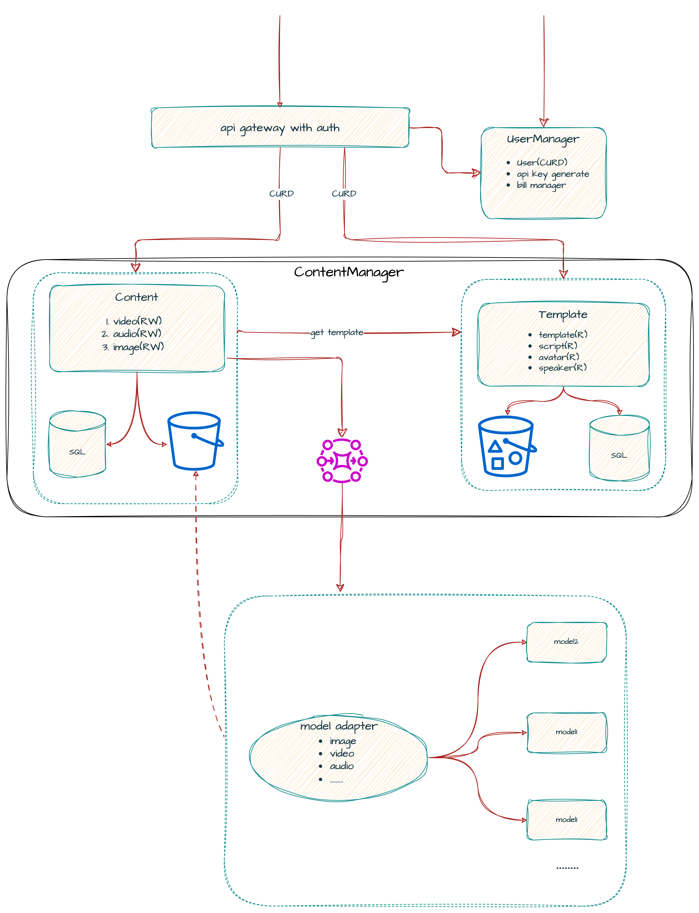

# Astra Protocol

## Introduction

Astra is the API documentation for the AIGC products within Astra.

## Architecture


## Usage
**Ensure that [Docker](https://www.docker.com) is installed on your computer**

### Generate API Interface
The API definitions are located in the **pb** folder. If you need to generate interfaces for specific languages, follow these steps:

1. Generate the proto environment image (skip this step if it already exists):
   ```bash
   make image
   ```

2. Generate the API interface:
   ```bash
   make proto
   ```

The Golang interface will be placed in the **api** folder, while interfaces for other languages and the Swagger interface will be available in the **all-languages-api** folder.

### Generate Documentation
```bash
make doc
```
The documentation will be available at [http://localhost:8000](http://localhost:8000). If it doesn't display, please check whether port 8000 is already in use.

## Common API Conventions

### JSON Encoding Rules

1. For string subtypes:
    - **string(int64)** for request fields: Accepts either a number or a numeric string. If the number is too large (above 2^31) and is subject to JSON Number precision limitations, it is recommended to use a string representation.
    - **string(int64)** for response fields: Provided as a string representing a decimal number, e.g., "1000000".
    - **string(byte)** for both request/response fields: Pass Base64-encoded binary data, e.g., "YWJjMTIzIT8kKiYoKSctPUB+".
    - **string(date-time)** for both request/response fields: Pass a date string in RFC 3339 format, e.g., "2017-01-01T10:00:20.021Z".
2. Default values when request fields are missing:
    - For **string**: Defaults to an empty string "".
    - For **int32/int64/float**: Defaults to 0.
    - For **bool**: Defaults to false.
    - For **object**: Defaults to null.
    - For **array**: Defaults to an empty array.
3. Missing fields in responses should follow the above rules.

### Error Codes

1. When an error occurs during service processing, the service returns a standardized JSON format as shown below:
    ```json
    {"code": 1, "message": "verbose error message"}
    ```
2. In the event of an error, the returned HTTP error code and the meaning of the `code` field are as follows:

| Code | Abbreviation         | HTTP Status Code | Explanation                        |
|------|----------------------|------------------|------------------------------------|
| 0    | OK                   | 200              | Success                            |
| 3    | INVALID_ARGUMENT     | 400              | Invalid parameter                  |
| 5    | NOT_FOUND            | 404              | Resource not found                 |
| 6    | ALREADY_EXISTS       | 409              | Resource already exists            |
| 7    | PERMISSION_DENIED    | 403              | Unauthorized access                |
| 8    | RESOURCE_EXHAUSTED   | 429              | Too many simultaneous calls by the user |
| 9    | FAILED_PRECONDITION  | 402              | Insufficient user balance          |
| 12   | UNIMPLEMENTED        | 501              | Not implemented                    |
| 13   | INTERNAL             | 500              | Internal server error              |
| 16   | UNAUTHENTICATED      | 401              | User not authenticated/authorization failed |

### API Authentication
Authentication is divided into `API_KEY` and `TOKEN`.

When accessing resources, the user should include the TOKEN/API_KEY in the HTTP Authorization header in the following format:
```
Authorization: Bearer [TOKEN/API_KEY]
```

## Models:
### API-PROXY-SERVICE

Language: GOLANG

An external proxy service responsible for authenticating interfaces and forwarding requests to the appropriate services.

[API](pb/api-proxy-service/api.proto)

### USER-MANAGER-SERVICE
Language: GOLANG

A user management service responsible for managing users, handling user login authentication, and managing user credit functionalities.

[API](pb/user-manager-service/api.proto)

### CONTENT-MANAGER-SERVICE

Language: GOLANG

A content management service tasked with managing both public and user resources, including generating/deleting videos, retrieving portrait lists, and more.

[API](pb/content-manager-service/api.proto)

### MODEL-ADAPTER-SERVICE

Language: PYTHON

Responsible for invoking various models to generate videos or audio. It does not expose an API; instead, it receives requests via PUBSUB.

[API](pb/model-adapter-service/api.proto)

### METRICS-SERVICE

Language: GOLANG

Responsible for collecting metrics and uploading them to BigQuery. It does not has a HTTP interface, only GRPC.

[API](pb/metrics-server/api.proto)


